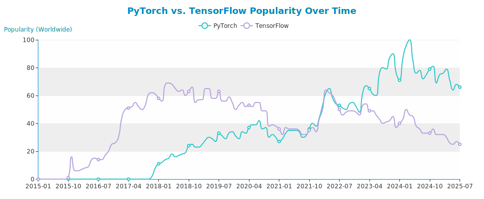

As someone who has recently embarked on the exciting journey of Machine Learning, I've discovered that success in ML isn't just about choosing one framework—it's about building a comprehensive toolkit that covers every stage of the ML pipeline. This series, "ML Odyssey," documents my learning journey and the strategic decisions behind our tool choices.

## The Complete ML Pipeline

Machine learning is much more than just training models. It's a comprehensive process that requires the right tools at each stage:

<div style="display: grid; grid-template-columns: repeat(auto-fit, minmax(220px, 1fr)); gap: 15px; margin: 30px 0; max-width: 1000px;">
    <div style="background: linear-gradient(135deg, #667eea 0%, #764ba2 100%); color: white; padding: 20px; border-radius: 10px; text-align: center; position: relative;">
        <div style="position: absolute; top: 5px; left: 10px; background: rgba(255,255,255,0.2); border-radius: 50%; width: 25px; height: 25px; display: flex; align-items: center; justify-content: center; font-size: 0.8rem; font-weight: bold;">1</div>
        <div style="font-size: 2rem; margin-bottom: 10px;">📊</div>
        <h3 style="margin: 0; color: white; font-size: 1.1rem;">Data Processing</h3>
        <p style="margin: 8px 0 0 0; color: #f0f0f0; font-size: 0.9rem;">NumPy & Pandas</p>
    </div>
    <div style="background: linear-gradient(135deg, #f093fb 0%, #f5576c 100%); color: white; padding: 20px; border-radius: 10px; text-align: center; position: relative;">
        <div style="position: absolute; top: 5px; left: 10px; background: rgba(255,255,255,0.2); border-radius: 50%; width: 25px; height: 25px; display: flex; align-items: center; justify-content: center; font-size: 0.8rem; font-weight: bold;">2</div>
        <div style="font-size: 2rem; margin-bottom: 10px;">📈</div>
        <h3 style="margin: 0; color: white; font-size: 1.1rem;">Data Visualization</h3>
        <p style="margin: 8px 0 0 0; color: #f0f0f0; font-size: 0.9rem;">Matplotlib & Seaborn</p>
    </div>
    <div style="background: linear-gradient(135deg, #4facfe 0%, #00f2fe 100%); color: white; padding: 20px; border-radius: 10px; text-align: center; position: relative;">
        <div style="position: absolute; top: 5px; left: 10px; background: rgba(255,255,255,0.2); border-radius: 50%; width: 25px; height: 25px; display: flex; align-items: center; justify-content: center; font-size: 0.8rem; font-weight: bold;">3</div>
        <div style="font-size: 2rem; margin-bottom: 10px;">🤖</div>
        <h3 style="margin: 0; color: white; font-size: 1.1rem;">Traditional ML</h3>
        <p style="margin: 8px 0 0 0; color: #f0f0f0; font-size: 0.9rem;">Scikit-learn</p>
    </div>
    <div style="background: linear-gradient(135deg, #fa709a 0%, #fee140 100%); color: white; padding: 20px; border-radius: 10px; text-align: center; position: relative;">
        <div style="position: absolute; top: 5px; left: 10px; background: rgba(255,255,255,0.2); border-radius: 50%; width: 25px; height: 25px; display: flex; align-items: center; justify-content: center; font-size: 0.8rem; font-weight: bold;">4</div>
        <div style="font-size: 2rem; margin-bottom: 10px;">🧠</div>
        <h3 style="margin: 0; color: white; font-size: 1.1rem;">Deep Learning</h3>
        <p style="margin: 8px 0 0 0; color: #f0f0f0; font-size: 0.9rem;">PyTorch</p>
    </div>
    <!-- <div style="background: linear-gradient(135deg,rgb(35, 206, 35) 0%,rgb(124, 238, 120) 100%); color: white; padding: 20px; border-radius: 10px; text-align: center; position: relative;">
        <div style="position: absolute; top: 5px; left: 10px; background: rgba(255,255,255,0.2); border-radius: 50%; width: 25px; height: 25px; display: flex; align-items: center; justify-content: center; font-size: 0.8rem; font-weight: bold;">5</div>
        <div style="font-size: 2rem; margin-bottom: 10px;">🤖</div>
        <h3 style="margin: 0; color: white; font-size: 1.1rem;">Evaluation</h3>
        <p style="margin: 8px 0 0 0; color: #f0f0f0; font-size: 0.9rem;">Scikit-learn</p>
    </div> -->
</div>

<div style="background-color: #e7f3ff; border-left: 4px solid #0066cc; padding: 1em; margin: 20px 0;">

📚 **Learning Progression**: This sequence follows the natural ML learning path—master data fundamentals first, then traditional algorithms, and finally advance to neural networks when you need that extra power!

</div>

Let's explore why we've chosen each tool and how they work together to create a powerful ML workflow.

## 1. Data Processing: The Foundation

Every successful ML project starts with clean, well-structured data. For this critical stage, we've chosen two powerhouse libraries:

<div style="display: grid; grid-template-columns: auto 1fr; gap: 20px; align-items: center; margin-bottom: 30px;">
    <a href="https://numpy.org/" target="_blank" rel="noopener">
        
    </a>
    <div>
        <strong>NumPy: The Numerical Foundation</strong>
        <small style="display: block; margin-bottom: 8px;">
            <a href="https://numpy.org/doc/stable/" target="_blank" rel="noopener">📚 Documentation</a>
        </small>
        <ul style="margin: 0;">
            <li>High-performance array operations and mathematical functions</li>
            <li>The backbone that powers pandas, PyTorch, and most ML libraries</li>
            <li>Essential for efficient numerical computations</li>
        </ul>
    </div>
</div>

<div style="display: grid; grid-template-columns: auto 1fr; gap: 20px; align-items: center; margin-bottom: 30px;">
    <a href="https://pandas.pydata.org/" target="_blank" rel="noopener">
        
    </a>
    <div>
        <strong>Pandas: Your Data Wrangling Swiss Army Knife</strong>
        <small style="display: block; margin-bottom: 8px;">
            <a href="https://pandas.pydata.org/docs/" target="_blank" rel="noopener">📚 Documentation</a>
        </small>
        <ul style="margin: 0;">
            <li>Intuitive data structures for labeled, heterogeneous data</li>
            <li>Powerful data manipulation and analysis capabilities</li>
            <li>Seamless integration with visualization and ML libraries</li>
        </ul>
    </div>
</div>

<div style="background-color: #f6f8fa; border-left: 4px solid #28a745; padding: 1em; margin-bottom: 1em;">

🎯 **Why This Combination Works**: NumPy provides the computational engine, while pandas adds the convenience layer for real-world data operations. Together, they handle everything from loading CSV files to complex data transformations—the essential foundation for any ML pipeline.

</div>

| Feature | NumPy | Pandas |
|---------|-------|--------|
| **Primary Use** | ✅ Numerical computations | ✅ Data manipulation & analysis |
| **Data Types** | 🔄 Homogeneous arrays | ✅ Mixed data types, missing values |
| **Performance** | ✅ Extremely fast | 🔄 Fast for most operations |
| **Learning Curve** | 🔄 Steeper for beginners | ✅ More intuitive API |

## 2. Data Visualization: Seeing Your Data

Understanding your data through visualization is crucial before building any ML model. Our visualization toolkit combines flexibility with beauty:

<div style="display: grid; grid-template-columns: auto 1fr; gap: 20px; align-items: center; margin-bottom: 30px;">
    <a href="https://matplotlib.org/" target="_blank" rel="noopener">
        
    </a>
    <div>
        <strong>Matplotlib: The Visualization Foundation</strong>
        <small style="display: block; margin-bottom: 8px;">
            <a href="https://matplotlib.org/stable/" target="_blank" rel="noopener">📚 Documentation</a>
        </small>
        <ul style="margin: 0;">
            <li>Complete control over every aspect of your plots</li>
            <li>Publication-quality figures and scientific visualizations</li>
            <li>The foundation that powers most Python plotting libraries</li>
        </ul>
    </div>
</div>

<div style="display: grid; grid-template-columns: auto 1fr; gap: 20px; align-items: center; margin-bottom: 30px;">
    <a href="https://seaborn.pydata.org/" target="_blank" rel="noopener">
        
    </a>
    <div>
        <strong>Seaborn: Statistical Visualization Made Beautiful</strong>
        <small style="display: block; margin-bottom: 8px;">
            <a href="https://seaborn.pydata.org/tutorial.html" target="_blank" rel="noopener">📚 Documentation</a>
        </small>
        <ul style="margin: 0;">
            <li>Modern, attractive statistical graphics out of the box</li>
            <li>Perfect integration with pandas DataFrames</li>
            <li>Complex statistical visualizations with simple commands</li>
        </ul>
    </div>
</div>

<div style="background-color: #f6f8fa; border-left: 4px solid #6f42c1; padding: 1em; margin-bottom: 1em;">

📊 **Visualization Strategy**: Matplotlib provides the canvas and fine control, while Seaborn adds statistical insight and modern aesthetics. This combination lets you create both quick exploratory plots and publication-ready figures.

</div>

## 3. Traditional Machine Learning: Scikit-learn

Before diving into neural networks, it's essential to master traditional ML algorithms. Scikit-learn is your perfect starting point:

**Scikit-learn: Where ML Fundamentals Shine**

Perfect for when you don't need the complexity of deep learning:

* 📈 **Traditional Algorithms**: Comprehensive collection of regression, classification, and clustering algorithms
* 🛠️ **Data Processing**: Robust preprocessing, feature selection, and model evaluation tools  
* 🧪 **Easy Integration**: Seamless workflow with NumPy and pandas
* 🖥️ **Learning-Focused**: Excellent for understanding ML fundamentals and baselines

Many real-world problems are solved more effectively with traditional ML than deep learning!

## 4. Deep Learning: When You Need Neural Networks

Once you've mastered traditional ML, PyTorch opens the door to neural networks and deep learning:

**PyTorch: The Modern ML Framework**

PyTorch has emerged as the leading choice for deep learning practitioners:

* 🐍 **Intuitive and Pythonic**: Natural coding style that follows Python's philosophy
* 🧩 **Dynamic and Flexible**: Real-time model modifications and easier debugging
* 🚀 **Research to Production**: Seamless transition from experimentation to deployment
* 🛠️ **Rich Ecosystem**: Extensive libraries for vision, NLP, and audio processing
* 👥 **Growing Community**: Strong adoption in research and industry

PyTorch's approach to machine learning feels natural to Python developers, making it an excellent choice for both beginners and experts.

### PyTorch vs TensorFlow: The Popularity Trend

Here's how PyTorch has been gaining momentum against TensorFlow over recent years:

<figure>

    <figcaption>
        <h4>Source: <a href="https://trends.google.es/trends/explore?date=2015-01-01%202025-07-21&q=%2Fg%2F11gd3905v1,%2Fg%2F11bwp1s2k3&hl=en" target="_blank" rel="noopener">Google Trends</a></h4>
    </figcaption>
</figure>


<!-- 
{
  "title": {
      "text": "PyTorch vs. TensorFlow Popularity Over Time",
      "top": "2%",
      "left": "center"
  },
  "tooltip": {
      "trigger": "axis"
  },
  "legend": {
      "data": [
          "PyTorch",
          "TensorFlow"
      ],
      "top": "10%"
  },
  "grid": {
      "left": "5%",
      "right": "5%",
      "bottom": "5%",
      "top": "20%",
      "containLabel": true
  },
  "toolbox": {
      "feature": {
          "saveAsImage": {
              "title": "Save as Image"
          }
      }
  },
  "xAxis": {
    "type": "category",
    "boundaryGap": false,
    "data": ["2015-01","2015-02","2015-03","2015-04","2015-05","2015-06","2015-07","2015-08","2015-09","2015-10","2015-11","2015-12","2016-01","2016-02","2016-03","2016-04","2016-05","2016-06","2016-07","2016-08","2016-09","2016-10","2016-11","2016-12","2017-01","2017-02","2017-03","2017-04","2017-05","2017-06","2017-07","2017-08","2017-09","2017-10","2017-11","2017-12","2018-01","2018-02","2018-03","2018-04","2018-05","2018-06","2018-07","2018-08","2018-09","2018-10","2018-11","2018-12","2019-01","2019-02","2019-03","2019-04","2019-05","2019-06","2019-07","2019-08","2019-09","2019-10","2019-11","2019-12","2020-01","2020-02","2020-03","2020-04","2020-05","2020-06","2020-07","2020-08","2020-09","2020-10","2020-11","2020-12","2021-01","2021-02","2021-03","2021-04","2021-05","2021-06","2021-07","2021-08","2021-09","2021-10","2021-11","2021-12","2022-01","2022-02","2022-03","2022-04","2022-05","2022-06","2022-07","2022-08","2022-09","2022-10","2022-11","2022-12","2023-01","2023-02","2023-03","2023-04","2023-05","2023-06","2023-07","2023-08","2023-09","2023-10","2023-11","2023-12","2024-01","2024-02","2024-03","2024-04","2024-05","2024-06","2024-07","2024-08","2024-09","2024-10","2024-11","2024-12","2025-01","2025-02","2025-03","2025-04","2025-05","2025-06","2025-07"]
  },
  "yAxis": {
      "type": "value",
      "name": "Popularity (Worldwide)"
  },
  "series": [
    {
        "name": "PyTorch",
        "type": "line",
        "data": [0,0,0,0,0,0,0,0,0,0,0,0,0,0,0,0,0,0,0,0,0,0,0,0,0,0,0,0,0,0,0,0,0,0,2,8,11,12,14,15,18,16,17,18,19,24,25,23,23,25,28,30,29,27,33,31,29,33,34,31,29,34,33,37,39,39,42,36,37,30,32,30,27,29,33,35,35,35,34,30,31,36,40,38,44,53,62,65,58,54,53,51,50,54,55,52,48,62,67,65,61,60,76,80,79,87,90,76,71,87,96,100,85,76,78,72,75,79,81,69,75,76,79,71,64,68,66]
    },
    {
        "name": "TensorFlow",
        "type": "line",
        "data": [0,0,0,0,0,0,0,0,0,1,16,6,6,7,8,9,14,15,14,14,17,20,25,26,30,44,50,51,52,55,52,50,53,61,62,61,58,56,68,69,68,65,63,64,60,63,66,55,57,57,65,65,58,58,63,56,56,59,55,50,53,55,52,53,52,55,55,49,49,38,39,38,36,32,37,36,36,36,35,32,32,35,37,34,43,50,64,62,60,55,50,46,48,49,49,48,46,53,54,49,49,46,43,40,41,42,45,37,40,43,50,46,45,38,36,33,33,33,36,32,32,32,30,26,25,27,25]
    }
  ]
}
 -->

## When to Use Traditional ML vs Deep Learning

Understanding when to use each approach is crucial for ML success:

| Aspect | Traditional ML (Scikit-learn) | Deep Learning (PyTorch) |
|--------|-------------------------------|-------------------------|
| **Best For** | ✅ Tabular data, small datasets, interpretability | ✅ Images, text, large datasets, complex patterns |
| **Data Requirements** | ✅ Works well with small datasets (100s-1000s) | 🔄 Needs large datasets (1000s-millions) |
| **Training Time** | ✅ Fast training, quick iterations | 🔄 Longer training, requires patience |
| **Interpretability** | ✅ Easy to understand and explain | 🔄 "Black box" behavior |
| **Learning Curve** | ✅ Gentle, mathematical concepts | 🔄 Steeper, many hyperparameters |
| **When to Start** | ✅ **Start here** - build fundamentals | 🔄 **After mastering traditional ML** |


### Our Learning-First Approach

1. **🏗️ Build Strong Foundations**: Start with scikit-learn to understand core ML concepts
2. **📊 Master Data Fundamentals**: Learn how algorithms work before neural networks abstract them away  
3. **🎯 Traditional ML First**: Many problems are solved better without deep learning
4. **🧠 Graduate to Neural Networks**: PyTorch becomes intuitive after understanding ML fundamentals
5. **🔄 Use Both Together**: Scikit-learn for preprocessing/baselines, PyTorch for complex patterns

## What's Coming in This Series?

Our ML Odyssey will take you through practical, hands-on projects using this complete toolkit:

<div style="background-color: #e8f4fd; border: 2px solid #0066cc; border-radius: 12px; padding: 20px; margin: 20px 0;">
<h3 style="margin: 0 0 15px 0; color: #0066cc; text-align: center;">📖 Legend - Understanding the Visual Guide</h3>

<div style="display: flex; flex-wrap: wrap; gap: 15px; justify-content: center;">
    <div style="background-color: #d4edda; border: 1px solid #c3e6cb; border-radius: 8px; padding: 15px; text-align: center; min-width: 160px;">
        <div style="font-size: 1.5rem; margin-bottom: 8px;">✓</div>
        <h4 style="margin: 0; color: #155724;">Published & Ready</h4>
        <p style="margin: 5px 0 0 0; font-size: 0.85rem; color: #155724;">Green border - Available to read</p>
    </div>
    <div style="background-color: #f8f9fa; border: 1px solid #dee2e6; border-radius: 8px; padding: 15px; text-align: center; min-width: 160px;">
        <div style="font-size: 1.5rem; margin-bottom: 8px;">⚠</div>
        <h4 style="margin: 0; color: #495057;">Work in Progress</h4>
        <p style="margin: 5px 0 0 0; font-size: 0.85rem; color: #6c757d;">Grey border - Coming soon</p>
    </div>
    <div style="background-color: #fff3e0; border: 1px solid #ffcc80; border-radius: 8px; padding: 15px; text-align: center; min-width: 160px;">
        <div style="font-size: 1.5rem; margin-bottom: 8px;">📚 🛠️</div>
        <h4 style="margin: 0; color: #e65100;">Content Type</h4>
        <p style="margin: 5px 0 0 0; font-size: 0.85rem; color: #bf360c;">📚 Theory | 🛠️ Practice</p>
    </div>
</div>
</div>

<!-- Published Posts -->
<div style="display: flex; flex-wrap: wrap; gap: 15px; margin: 20px 0;">

<div style="flex: 1; min-width: 280px; background-color: #f8f9fa; border: 3px solid #28a745; border-radius: 8px; padding: 15px; position: relative;">
<div style="position: absolute; top: 8px; right: 8px; background: #6c757d; color: white; border-radius: 50%; width: 32px; height: 32px; display: flex; align-items: center; justify-content: center; font-size: 1.1rem;">📚</div>
<div style="position: absolute; top: 8px; left: 8px; background: #28a745; color: white; border-radius: 50%; width: 24px; height: 24px; display: flex; align-items: center; justify-content: center; font-size: 0.8rem;">✓</div>
<h4 style="margin-top: 30px; color: #495057;">Part 2: EDA Theory</h4>
<p style="margin-bottom: 0; font-size: 0.9em;">Understanding datasets, features, labels, and data quality fundamentals</p>
</div>

<div style="flex: 1; min-width: 280px; background-color: #e3f2fd; border: 3px solid #28a745; border-radius: 8px; padding: 15px; position: relative;">
<div style="position: absolute; top: 8px; right: 8px; background: #ff9800; color: white; border-radius: 50%; width: 32px; height: 32px; display: flex; align-items: center; justify-content: center; font-size: 1.1rem;">🛠️</div>
<div style="position: absolute; top: 8px; left: 8px; background: #28a745; color: white; border-radius: 50%; width: 24px; height: 24px; display: flex; align-items: center; justify-content: center; font-size: 0.8rem;">✓</div>
<h4 style="margin-top: 30px; color: #856404;">Part 3: EDA - Pokemon Dataset</h4>
<p style="margin-bottom: 0; font-size: 0.9em; color: #856404;"><strong>Hands-on Practice!</strong> Apply EDA techniques to real data</p>
</div>

<div style="flex: 1; min-width: 280px; background-color: #e8f5e8; border: 3px solid #28a745; border-radius: 8px; padding: 15px; position: relative;">
<div style="position: absolute; top: 8px; right: 8px; background: #6c757d; color: white; border-radius: 50%; width: 32px; height: 32px; display: flex; align-items: center; justify-content: center; font-size: 1.1rem;">📚</div>
<div style="position: absolute; top: 8px; left: 8px; background: #28a745; color: white; border-radius: 50%; width: 24px; height: 24px; display: flex; align-items: center; justify-content: center; font-size: 0.8rem;">✓</div>
<h4 style="margin-top: 30px; color: #28a745;">Part 4: Traditional ML Fundamentals</h4>
<p style="margin-bottom: 0; font-size: 0.9em; color: #155724;"><strong>Core Algorithms!</strong> Classification, regression, clustering theory</p>
</div>

</div>

<!-- Work in Progress Posts -->
<div style="display: flex; flex-wrap: wrap; gap: 15px; margin: 20px 0;">

<div style="flex: 1; min-width: 280px; background-color: #e3f2fd; border: 3px solid #6c757d; border-radius: 8px; padding: 15px; position: relative; opacity: 0.8;">
<div style="position: absolute; top: 8px; right: 8px; background: #ff9800; color: white; border-radius: 50%; width: 32px; height: 32px; display: flex; align-items: center; justify-content: center; font-size: 1.1rem;">🛠️</div>
<div style="position: absolute; top: 8px; left: 8px; background: #6c757d; color: white; border-radius: 50%; width: 24px; height: 24px; display: flex; align-items: center; justify-content: center; font-size: 0.8rem;">⚠</div>
<h4 style="margin-top: 30px; color: #856404;">Part 5: Traditional ML - Pokemon</h4>
<p style="margin-bottom: 0; font-size: 0.9em; color: #856404;"><strong>Apply Algorithms!</strong> Implement scikit-learn models</p>
</div>

<div style="flex: 1; min-width: 280px; background-color: #f8f9fa; border: 3px solid #6c757d; border-radius: 8px; padding: 15px; position: relative; opacity: 0.8;">
<div style="position: absolute; top: 8px; right: 8px; background: #6c757d; color: white; border-radius: 50%; width: 32px; height: 32px; display: flex; align-items: center; justify-content: center; font-size: 1.1rem;">📚</div>
<div style="position: absolute; top: 8px; left: 8px; background: #6c757d; color: white; border-radius: 50%; width: 24px; height: 24px; display: flex; align-items: center; justify-content: center; font-size: 0.8rem;">⚠</div>
<h4 style="margin-top: 30px; color: #495057;">Part 6: Neural Networks Fundamentals</h4>
<p style="margin-bottom: 0; font-size: 0.9em;">Deep learning concepts and framework comparisons</p>
</div>

<div style="flex: 1; min-width: 280px; background-color: #f8f9fa; border: 3px solid #6c757d; border-radius: 8px; padding: 15px; position: relative; opacity: 0.8;">
<div style="position: absolute; top: 8px; right: 8px; background: #6c757d; color: white; border-radius: 50%; width: 32px; height: 32px; display: flex; align-items: center; justify-content: center; font-size: 1.1rem;">📚</div>
<div style="position: absolute; top: 8px; left: 8px; background: #6c757d; color: white; border-radius: 50%; width: 24px; height: 24px; display: flex; align-items: center; justify-content: center; font-size: 0.8rem;">⚠</div>
<h4 style="margin-top: 30px; color: #495057;">Part 7: PyTorch Theory</h4>
<p style="margin-bottom: 0; font-size: 0.9em;">Tensors, automatic differentiation, and model optimization</p>
</div>

<div style="flex: 1; min-width: 280px; background-color: #fff3cd; border: 3px solid #6c757d; border-radius: 8px; padding: 15px; position: relative; opacity: 0.8;">
<div style="position: absolute; top: 8px; right: 8px; background: #ff9800; color: white; border-radius: 50%; width: 32px; height: 32px; display: flex; align-items: center; justify-content: center; font-size: 1.1rem;">🛠️</div>
<div style="position: absolute; top: 8px; left: 8px; background: #6c757d; color: white; border-radius: 50%; width: 24px; height: 24px; display: flex; align-items: center; justify-content: center; font-size: 0.8rem;">⚠</div>
<h4 style="margin-top: 30px; color: #856404;">Part 8: PyTorch Practice</h4>
<p style="margin-bottom: 0; font-size: 0.9em; color: #856404;"><strong>Build Neural Networks!</strong> Hands-on deep learning implementation</p>
</div>

<div style="flex: 1; min-width: 280px; background-color: #fff3cd; border: 3px solid #6c757d; border-radius: 8px; padding: 15px; position: relative; opacity: 0.8;">
<div style="position: absolute; top: 8px; right: 8px; background: #ff9800; color: white; border-radius: 50%; width: 32px; height: 32px; display: flex; align-items: center; justify-content: center; font-size: 1.1rem;">🛠️</div>
<div style="position: absolute; top: 8px; left: 8px; background: #6c757d; color: white; border-radius: 50%; width: 24px; height: 24px; display: flex; align-items: center; justify-content: center; font-size: 0.8rem;">⚠</div>
<h4 style="margin-top: 30px; color: #856404;">Part 9: Berlin Housing Problem</h4>
<p style="margin-bottom: 0; font-size: 0.9em; color: #856404;"><strong>Real-World Project!</strong> Regression with traditional ML and neural networks</p>
</div>

<div style="flex: 1; min-width: 280px; background-color: #fff3cd; border: 3px solid #6c757d; border-radius: 8px; padding: 15px; position: relative; opacity: 0.8;">
<div style="position: absolute; top: 8px; right: 8px; background: #ff9800; color: white; border-radius: 50%; width: 32px; height: 32px; display: flex; align-items: center; justify-content: center; font-size: 1.1rem;">🛠️</div>
<div style="position: absolute; top: 8px; left: 8px; background: #6c757d; color: white; border-radius: 50%; width: 24px; height: 24px; display: flex; align-items: center; justify-content: center; font-size: 0.8rem;">⚠</div>
<h4 style="margin-top: 30px; color: #856404;">Part 10: Bone Fractures Image Dataset</h4>
<p style="margin-bottom: 0; font-size: 0.9em; color: #856404;"><strong>Computer Vision!</strong> Image classification with deep learning</p>
</div>

<div style="flex: 1; min-width: 280px; background-color: #fff3cd; border: 3px solid #6c757d; border-radius: 8px; padding: 15px; position: relative; opacity: 0.8;">
<div style="position: absolute; top: 8px; right: 8px; background: #ff9800; color: white; border-radius: 50%; width: 32px; height: 32px; display: flex; align-items: center; justify-content: center; font-size: 1.1rem;">🛠️</div>
<div style="position: absolute; top: 8px; left: 8px; background: #6c757d; color: white; border-radius: 50%; width: 24px; height: 24px; display: flex; align-items: center; justify-content: center; font-size: 0.8rem;">⚠</div>
<h4 style="margin-top: 30px; color: #856404;">Part 11: NLP with Scikit-learn</h4>
<p style="margin-bottom: 0; font-size: 0.9em; color: #856404;"><strong>Text Analysis!</strong> Natural language processing fundamentals</p>
</div>

<div style="flex: 1; min-width: 280px; background-color: #f8f9fa; border: 3px solid #6c757d; border-radius: 8px; padding: 15px; position: relative; opacity: 0.8;">
<div style="position: absolute; top: 8px; right: 8px; background: #6c757d; color: white; border-radius: 50%; width: 32px; height: 32px; display: flex; align-items: center; justify-content: center; font-size: 1.1rem;">📚</div>
<div style="position: absolute; top: 8px; left: 8px; background: #6c757d; color: white; border-radius: 50%; width: 24px; height: 24px; display: flex; align-items: center; justify-content: center; font-size: 0.8rem;">⚠</div>
<h4 style="margin-top: 30px; color: #495057;">Part 12: Web Scraping with Python</h4>
<p style="margin-bottom: 0; font-size: 0.9em;">Data collection techniques and ethical scraping practices</p>
</div>

<div style="flex: 1; min-width: 280px; background-color: #f8f9fa; border: 3px solid #6c757d; border-radius: 8px; padding: 15px; position: relative; opacity: 0.8;">
<div style="position: absolute; top: 8px; right: 8px; background: #6c757d; color: white; border-radius: 50%; width: 32px; height: 32px; display: flex; align-items: center; justify-content: center; font-size: 1.1rem;">📚</div>
<div style="position: absolute; top: 8px; left: 8px; background: #6c757d; color: white; border-radius: 50%; width: 24px; height: 24px; display: flex; align-items: center; justify-content: center; font-size: 0.8rem;">⚠</div>
<h4 style="margin-top: 30px; color: #495057;">Part 13: Kubeflow Pipelines Intro</h4>
<p style="margin-bottom: 0; font-size: 0.9em;">ML pipeline orchestration and MLOps fundamentals</p>
</div>

<div style="flex: 1; min-width: 280px; background-color: #f8f9fa; border: 3px solid #6c757d; border-radius: 8px; padding: 15px; position: relative; opacity: 0.8;">
<div style="position: absolute; top: 8px; right: 8px; background: #6c757d; color: white; border-radius: 50%; width: 32px; height: 32px; display: flex; align-items: center; justify-content: center; font-size: 1.1rem;">📚</div>
<div style="position: absolute; top: 8px; left: 8px; background: #6c757d; color: white; border-radius: 50%; width: 24px; height: 24px; display: flex; align-items: center; justify-content: center; font-size: 0.8rem;">⚠</div>
<h4 style="margin-top: 30px; color: #495057;">Part 14: Jupyter to Kubeflow</h4>
<p style="margin-bottom: 0; font-size: 0.9em;">Converting notebooks to production-ready ML pipelines</p>
</div>

<div style="flex: 1; min-width: 280px; background-color: #fff3cd; border: 3px solid #6c757d; border-radius: 8px; padding: 15px; position: relative; opacity: 0.8;">
<div style="position: absolute; top: 8px; right: 8px; background: #ff9800; color: white; border-radius: 50%; width: 32px; height: 32px; display: flex; align-items: center; justify-content: center; font-size: 1.1rem;">🛠️</div>
<div style="position: absolute; top: 8px; left: 8px; background: #6c757d; color: white; border-radius: 50%; width: 24px; height: 24px; display: flex; align-items: center; justify-content: center; font-size: 0.8rem;">⚠</div>
<h4 style="margin-top: 30px; color: #856404;">Part 15: Kubeflow Pipelines Exercise</h4>
<p style="margin-bottom: 0; font-size: 0.9em; color: #856404;"><strong>Production ML!</strong> Deploy and orchestrate ML workflows</p>
</div>

<div style="flex: 1; min-width: 280px; background-color: #f8f9fa; border: 3px solid #6c757d; border-radius: 8px; padding: 15px; position: relative; opacity: 0.8;">
<div style="position: absolute; top: 8px; right: 8px; background: #6c757d; color: white; border-radius: 50%; width: 32px; height: 32px; display: flex; align-items: center; justify-content: center; font-size: 1.1rem;">📚</div>
<div style="position: absolute; top: 8px; left: 8px; background: #6c757d; color: white; border-radius: 50%; width: 24px; height: 24px; display: flex; align-items: center; justify-content: center; font-size: 0.8rem;">⚠</div>
<h4 style="margin-top: 30px; color: #495057;">Part 16: ML Project Management</h4>
<p style="margin-bottom: 0; font-size: 0.9em;">Version control, experiment tracking, and model versioning</p>
</div>

</div>


<div style="background-color: #f0f9ff; border-left: 4px solid #3b82f6; padding: 1em; margin: 20px 0;">

🎯 **Learning Path**: Notice how we start with data fundamentals, master traditional ML with scikit-learn, then graduate to neural networks with PyTorch. This progression ensures you understand the "why" before diving into the "how" of deep learning!

</div>

All code examples are available in our [ML Odyssey repository](https://github.com/alvarolop/ml-odyssey), complete with:

* 📓 Detailed **Jupyter notebooks** for interactive learning
* 🚀 Production-ready **deployment examples**
* 🛠️ Integration guides for the complete toolkit


## Setting Up Your Environment

We will use Python's built-in `venv` to create isolated spaces for your project dependencies, preventing the dreaded "dependency hell" on your Fedora system. Think of them as miniature, self-contained Python installations just for your ML work!

`venv` is Python's standard way to create lightweight virtual environments. It's built right into Python 3, so you don't need any extra installations beyond your core Python.

1. **Create Your Virtual Environment**. I like to keep it in my home directory:
   ```bash
   python3 -m venv ~/venv
   ```

2. **Activate the Virtual Environment**. This command modifies your shell's `PATH` to point to the virtual environment's Python and `pip`:
   ```bash
   source ~/venv/bin/activate
   ```
   You'll notice `(venv)` appearing at the start of your terminal prompt. This is your visual cue that you're operating within the virtual environment. All packages you install now will live here, not globally.

3. **Install PyTorch and Dependencies**. With your virtual environment activated, you can install PyTorch with the command provided in the [PyTorch installation guide](https://pytorch.org/get-started/locally/). For example, to install the CPU version of PyTorch, you can run:
   ```bash
   # Deep learning framework
   pip install torch torchvision torchaudio --index-url https://download.pytorch.org/whl/cpu
   ```

4. **Install the Complete Data Science Stack**:
   ```bash
   # Data processing and visualization
   pip install numpy pandas matplotlib seaborn
   
   # Traditional machine learning
   pip install scikit-learn
   
   # Development and experimentation tools
   pip install jupyterlab kagglehub scipy

   # Spatial analysis library
   pip install libpysal esda
   ```

5. **Start JupyterLab**. With everything set up, launch your ML workspace:
   ```bash
   jupyter lab
   ```

<div style="background-color: #d4edda; border-left: 4px solid #28a745; padding: 1em; margin-bottom: 1em;">

✅ **Success!** You now have a complete ML toolkit ready for the entire learning journey:
- **🔢 Data Processing**: NumPy & Pandas  
- **📊 Visualization**: Matplotlib & Seaborn
- **🤖 Traditional ML**: Scikit-learn *(start here for algorithms!)*
- **🧠 Deep Learning**: PyTorch *(after mastering traditional ML)*
- **💻 Development**: JupyterLab

</div>

## References

This series draws inspiration from excellent resources like:

* **"Hands-On Machine Learning with Scikit-Learn, Keras, and TensorFlow"** by Aurélien Géron
* **"Deep Learning with PyTorch"** by Stevens, Antiga, and Viehmann
* **"Python for Data Analysis"** by Wes McKinney
* **Official documentation** for all the libraries we use

Join me in this learning journey as we explore the fascinating world of machine learning with a complete, production-ready toolkit! The focus will be on practical, hands-on learning that you can apply immediately to your own projects.

