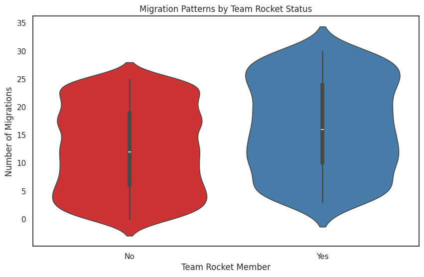
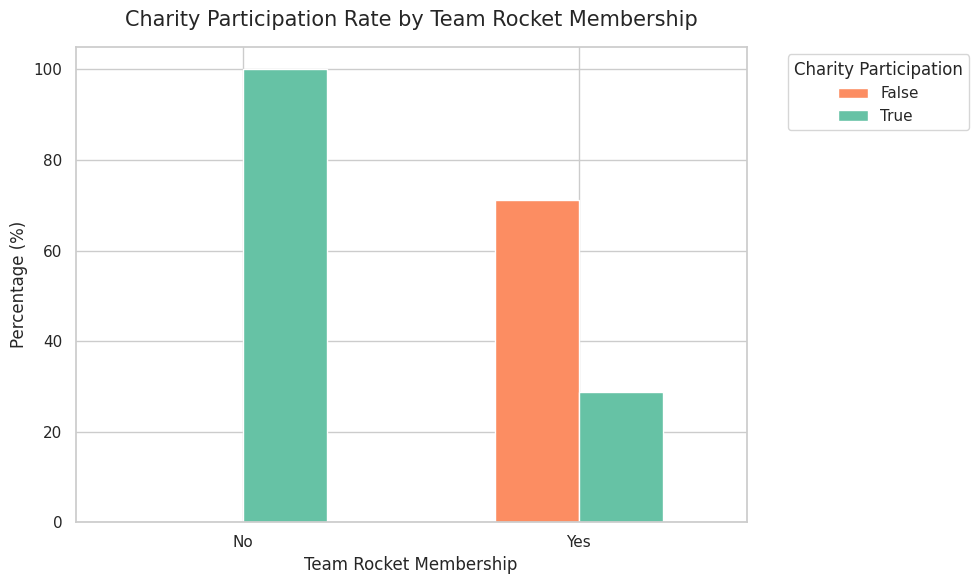
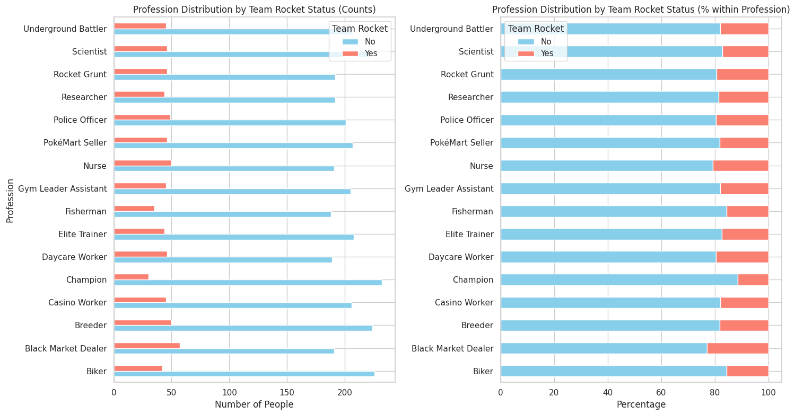
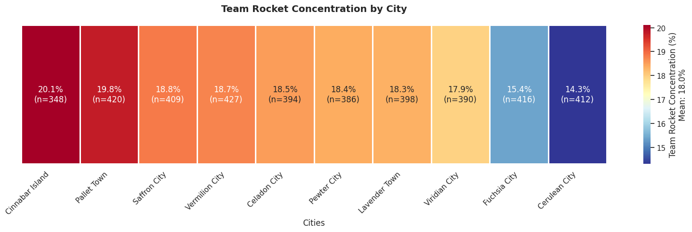
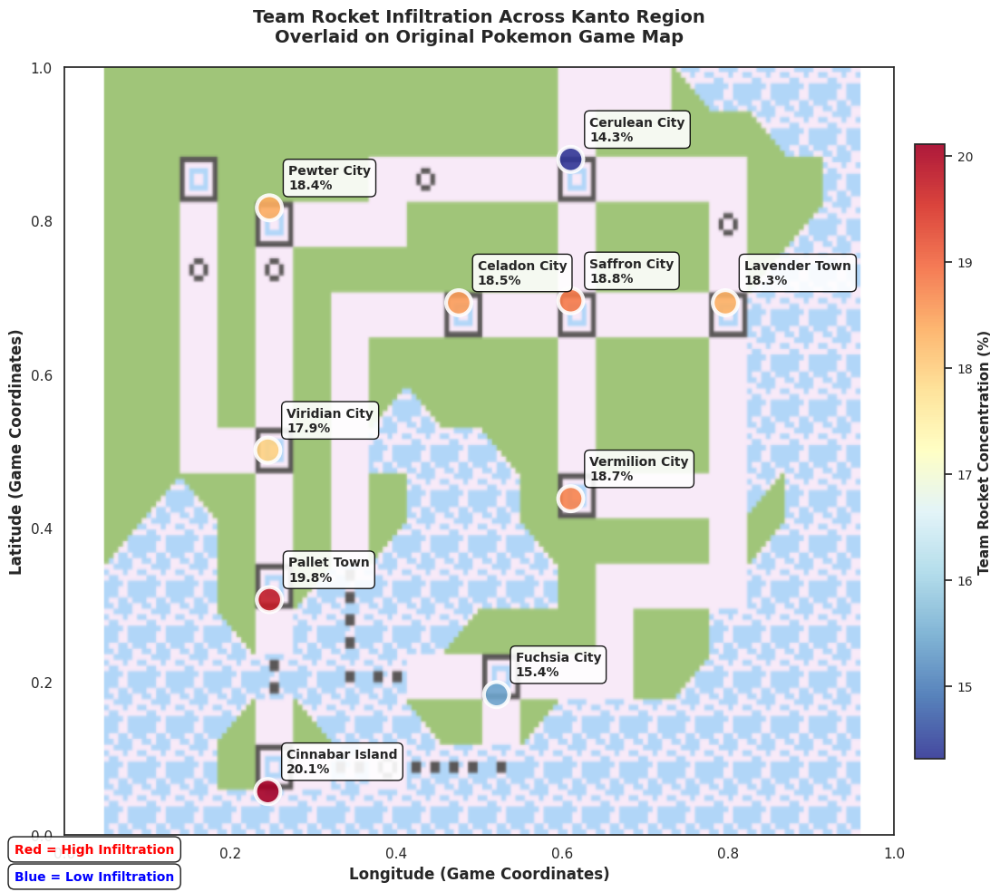
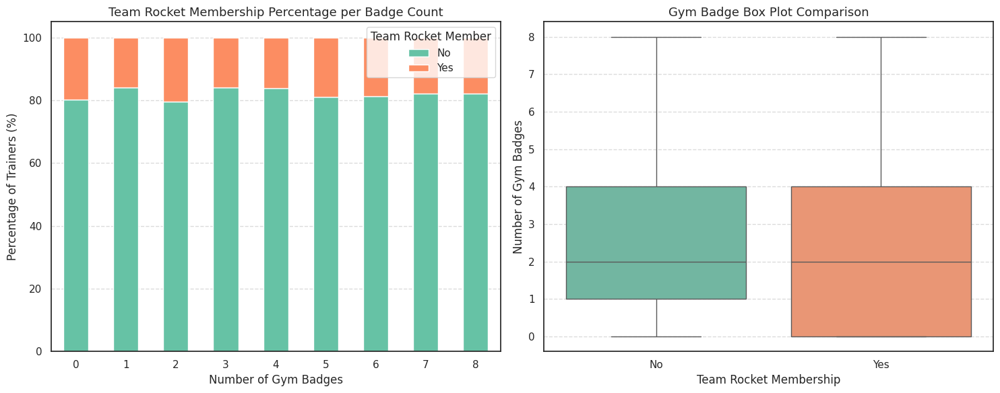


In our [previous posts](/2025/08/ml-odyssey-part-3-statistical-analysis-eda-theory/), we explored both the programming fundamentals with pandas, matplotlib, and seaborn (Part 2), and the statistical concepts behind effective data analysis (Part 3). Today, we'll apply everything we've learned to real data analysis.



## Q5. Are migration patterns different for Team Rocket members?

* 📈 Graph: Violin plot of migration counts per group.
* 🌍 Test: Mann-Whitney U test.

```python {open=true, lineNos=true}
from scipy.stats import mannwhitneyu

# Violin plot: Migration patterns by Team Rocket status
plt.figure(figsize=(10, 6))
sns.violinplot(
    data=pokemon_df,
    x='Team Rocket',
    y='Number of Migrations',
    hue='Team Rocket',
    palette='Set1',
    legend=False
)
plt.title('Migration Patterns by Team Rocket Status')
plt.xlabel('Team Rocket Member')
plt.ylabel('Number of Migrations')
plt.show()

# Mann-Whitney U test for migration differences
# Separate the groups
rocket_migrations = pokemon_df[pokemon_df['Team Rocket'] == 'Yes']['Number of Migrations'].dropna()
non_rocket_migrations = pokemon_df[pokemon_df['Team Rocket'] == 'No']['Number of Migrations'].dropna()

# Perform Mann-Whitney U test
statistic, p_value = mannwhitneyu(rocket_migrations, non_rocket_migrations, alternative='two-sided')

print(f"Mann-Whitney U statistic: {statistic:.2f}")
print(f"p-value: {p_value:.4f}")

# Additional descriptive statistics
print(f"\nDescriptive Statistics:")
print(f"Team Rocket members - Median migrations: {rocket_migrations.median():.1f}")
print(f"Non-Team Rocket members - Median migrations: {non_rocket_migrations.median():.1f}")
print(f"Team Rocket members - Mean migrations: {rocket_migrations.mean():.1f}")
print(f"Non-Team Rocket members - Mean migrations: {non_rocket_migrations.mean():.1f}")

if p_value < 0.05:
    print("Result: 🏆 Significant migration pattern differences found between Team Rocket and non-Team Rocket members.")
else:
    print("Result: 🧐 No significant migration pattern differences found.")
```



Mann-Whitney U statistic: 1510978.50
p-value: 0.0000

Descriptive Statistics:
Team Rocket members - Median migrations: 16.0
Non-Team Rocket members - Median migrations: 12.0
Team Rocket members - Mean migrations: 16.6
Non-Team Rocket members - Mean migrations: 12.5
Result: 🏆 Significant migration pattern differences found between Team Rocket and non-Team Rocket members.





## Q6. Do Rocket members tend to avoid charity participation?

* 📊 Graph: Grouped bar chart of charity participation rates.
* 🕵️‍♂️ Test: Fisher’s Exact Test for small sample sizes.

```python {open=true, lineNos=true}
from scipy.stats import fisher_exact

# Data Preparation & Percentage Calculation
charity_counts = pd.crosstab(pokemon_df['Charity Participation'], pokemon_df['Team Rocket'])
charity_percent = charity_counts.T.div(charity_counts.T.sum(axis=1), axis=0).mul(100)

# Visualization: Grouped Bar Chart
sns.set_theme(style="whitegrid")
plt.figure(figsize=(10, 6))

set2_colors = sns.color_palette('Set2', 2)
colors_for_plot = [set2_colors[1], set2_colors[0]]

charity_percent.plot(
    kind='bar',
    ax=plt.gca(),
    color=colors_for_plot
)

plt.title('Charity Participation Rate by Team Rocket Membership', fontsize=15, pad=15)
plt.xlabel('Team Rocket Membership', fontsize=12)
plt.ylabel('Percentage (%)', fontsize=12)
plt.xticks(rotation=0)
plt.legend(title='Charity Participation', bbox_to_anchor=(1.05, 1), loc='upper left')
plt.tight_layout()
plt.show()

# Statistical Test: Fisher's Exact Test
oddsratio, p_fisher = fisher_exact(charity_counts.values)

print(f"\nFisher's Exact Test p-value: {p_fisher:.4f}")

if p_fisher < 0.05:
    print("Result: 🏆 Significant association between charity participation and Team Rocket membership.")
else:
    print("Result: 🧐 No significant association found.")

```



Fisher's Exact Test p-value: 0.0000
Result: 🏆 Significant association between charity participation and Team Rocket membership.



## Q7. Do Rocket members disguise themselves in certain professions?

* 📊 Graph: Horizontal bar chart of profession frequency per group.
* 🕵️‍♂️ Test: Chi-square test for profession-Team Rocket relationship.

**Chart Analysis: Profession Distribution Visualization**

```python {open=true, lineNos=true}
import numpy as np
from scipy.stats import chi2_contingency

# Create a cross-tabulation of professions vs Team Rocket status
profession_crosstab = pd.crosstab(pokemon_df['Profession'], pokemon_df['Team Rocket'])

# Map the integer index back to the original profession names
profession_crosstab.index = label_encoders['Profession'].inverse_transform(profession_crosstab.index)

# Calculate percentages for better visualization
profession_percent = profession_crosstab.div(profession_crosstab.sum(axis=1), axis=0).multiply(100)

# Create horizontal bar chart
fig, (ax1, ax2) = plt.subplots(1, 2, figsize=(15, 8))

# Subplot 1: Raw counts
profession_crosstab.plot(kind='barh', ax=ax1, color=['skyblue', 'salmon'])
ax1.set_title('Profession Distribution by Team Rocket Status (Counts)')
ax1.set_xlabel('Number of People')
ax1.set_ylabel('Profession')
ax1.legend(title='Team Rocket')

# Subplot 2: Percentages within each profession
profession_percent.plot(kind='barh', ax=ax2, color=['skyblue', 'salmon'], stacked=True)
ax2.set_title('Profession Distribution by Team Rocket Status (% within Profession)')
ax2.set_xlabel('Percentage')
ax2.set_ylabel('')
ax2.legend(title='Team Rocket')

plt.tight_layout()
plt.show()
```






**Statistical Analysis: Chi-Square Test and Effect Size**

```python {open=true, lineNos=true}
# Chi-square test for independence
chi2_stat, p_value, dof, expected = chi2_contingency(profession_crosstab)

print(f"Chi-square test results:")
print(f"Chi-square statistic: {chi2_stat:.2f}")
print(f"Degrees of freedom: {dof}")
print(f"p-value: {p_value:.4f}")

# Show which professions have the highest Team Rocket percentages
print(f"\nProfession analysis:")
rocket_percentages = profession_percent['Yes'].sort_values(ascending=False)
print("Top 5 professions by Team Rocket percentage:")
for i, (profession, percentage) in enumerate(rocket_percentages.head().items(), 1):
    print(f"{i}. {profession}: {percentage:.1f}% Team Rocket members")

print(f"\nBottom 5 professions by Team Rocket percentage:")
for i, (profession, percentage) in enumerate(rocket_percentages.tail().items(), 1):
    print(f"{i}. {profession}: {percentage:.1f}% Team Rocket members")

# Statistical interpretation
if p_value < 0.05:
    print(f"\nResult: 🏆 Significant association found between profession and Team Rocket membership.")
    print("🕵️‍♂️ Some professions do appear to be preferred disguises for Team Rocket members!")
else:
    print(f"\nResult: 🧐 No significant association found between profession and Team Rocket membership.")
    print("Team Rocket members appear to be evenly distributed across professions.")

# Calculate effect size (Cramér's V)
n = profession_crosstab.sum().sum()
cramers_v = np.sqrt(chi2_stat / (n * (min(profession_crosstab.shape) - 1)))
print(f"Effect size (Cramér's V): {cramers_v:.3f}")

if cramers_v < 0.1:
    effect_interpretation = "negligible"
elif cramers_v < 0.3:
    effect_interpretation = "small"
elif cramers_v < 0.5:
    effect_interpretation = "medium"
else:
    effect_interpretation = "large"

print(f"Effect size interpretation: {effect_interpretation} association")
```



Chi-square test results:
Chi-square statistic: 16.18
Degrees of freedom: 15
p-value: 0.3701

Profession analysis:
Top 5 professions by Team Rocket percentage:
1. Black Market Dealer: 23.0% Team Rocket members
2. Nurse: 20.7% Team Rocket members
3. Police Officer: 19.6% Team Rocket members
4. Daycare Worker: 19.6% Team Rocket members
5. Rocket Grunt: 19.3% Team Rocket members

Bottom 5 professions by Team Rocket percentage:
1. Elite Trainer: 17.5% Team Rocket members
2. Scientist: 17.2% Team Rocket members
3. Fisherman: 15.7% Team Rocket members
4. Biker: 15.7% Team Rocket members
5. Champion: 11.5% Team Rocket members

Result: 🧐 No significant association found between profession and Team Rocket membership.
Team Rocket members appear to be evenly distributed across professions.
Effect size (Cramér's V): 0.064
Effect size interpretation: negligible association



## Q8. Is there an unusual cluster of Rocket members in specific cities?


* 🗺 Graph: Geographic heatmap of city distributions.
* 📌 Test: Spatial autocorrelation test.

To answer this question properly, we need to go beyond simple statistics and consider the geographic layout of cities. Let's break this analysis into clear steps:

### Q8.1. Initial Data Overview

Let's start by examining the distribution of Team Rocket members across cities with their actual coordinates:

```python {open=true, lineNos=true}
import numpy as np
from scipy.stats import chi2_contingency

# Create a cross-tabulation of cities vs Team Rocket status
city_crosstab = pd.crosstab(pokemon_df['City'], pokemon_df['Team Rocket'])

# Map the integer index back to the original city names
city_crosstab.index = label_encoders['City'].inverse_transform(city_crosstab.index)

# Calculate percentages of Team Rocket members per city
city_percentages = city_crosstab.div(city_crosstab.sum(axis=1), axis=0).multiply(100)
rocket_percentages_by_city = city_percentages['Yes'].sort_values(ascending=False)

# --- Visualization: Horizontal Heatmap ---
sns.set_theme(style="white")
plt.figure(figsize=(16, 5))

# Calculate overall average for the color bar label
overall_rocket_rate = (pokemon_df['Team Rocket'] == 'Yes').mean() * 100

# Create annotations showing percentage and total population per city
city_labels = rocket_percentages_by_city.index
city_totals = city_crosstab.sum(axis=1).loc[city_labels]
annotations = [f'{pct:.1f}%\n(n={total})' for pct, total in zip(rocket_percentages_by_city, city_totals)]

# Create a horizontal heatmap
sns.heatmap(
    rocket_percentages_by_city.values.reshape(1, -1),
    annot=np.array(annotations).reshape(1, -1),
    fmt='', cmap='RdYlBu_r',
    cbar_kws={
        'label': f'Team Rocket Concentration (%)\nMean: {overall_rocket_rate:.1f}%'
    },
    xticklabels=city_labels,
    yticklabels=[],
    linewidths=1, linecolor='white',
    square=False
)

plt.title('Team Rocket Concentration by City', pad=20, fontsize=14, fontweight='bold')
plt.xlabel('Cities', fontsize=12)
plt.xticks(rotation=45, ha='right', fontsize=11)
plt.yticks([]) # Removed the manual yticklabels to keep it cleaner

plt.grid(False)
for i in range(len(city_labels) + 1):
    plt.axvline(x=i, color='white', linewidth=1.5, alpha=0.8)

plt.tight_layout()
plt.show()
```



We can see some differences between cities. But are these differences statistically significant and geographically clustered?



### Q8.2. Standard Statistical Test (Chi-Square)

Now let's answer the core question: Are there unusual clusters? Let's use the chi-square test to determine if the clustering is significant.

```python {open=true, lineNos=true}
# Answer the core question: Are there unusual clusters of Team Rocket members?
print(f"🏙️ CLUSTERING ANALYSIS:")
print(f"Overall Team Rocket rate across all cities: {overall_rocket_rate:.1f}%")

# Show the range of variation across cities
max_city_rate = rocket_percentages_by_city.max()
min_city_rate = rocket_percentages_by_city.min()
rate_difference = max_city_rate - min_city_rate

print(f"\n📊 Variation across cities:")
print(f"• Highest concentration: {rocket_percentages_by_city.index[0]} ({max_city_rate:.1f}%)")
print(f"• Lowest concentration: {rocket_percentages_by_city.index[-1]} ({min_city_rate:.1f}%)")
print(f"• Difference: {rate_difference:.1f} percentage points")

# Statistical test to determine if clustering is significant
from scipy.stats import chi2_contingency
chi2_stat, p_value, dof, expected = chi2_contingency(city_crosstab)

print(f"\n🧪 Statistical Test (Chi-square):")
print(f"p-value: {p_value:.4f}")

if p_value < 0.05:
    print(f"🏆 ANSWER: YES - There ARE unusual clusters of Team Rocket members in specific cities!")
    print(f"🕵️‍♂️ The distribution is NOT random - some cities have significantly different concentrations.")
else:
    print(f"🧐 ANSWER: NO - Team Rocket members appear to be evenly distributed across cities.")
    print(f"📍 No statistically significant clustering detected.")
```



🏙️ CLUSTERING ANALYSIS:
Overall Team Rocket rate across all cities: 18.0%

📊 Variation across cities:
• Highest concentration: Cinnabar Island (20.1%)
• Lowest concentration: Cerulean City (14.3%)
• Difference: 5.8 percentage points

🧪 Statistical Test (Chi-square):
p-value: 0.5203
🧐 ANSWER: NO - Team Rocket members appear to be evenly distributed across cities.
📍 No statistically significant clustering detected.





**🤔 Why Can the Chi-square Test Be Misleading?**

- At first glance, some cities look way more "infiltrated" by Team Rocket than others.
- So why doesn't the Chi-square test always confirm this?  
  👉 **Because it only checks the *amount* in each city, not *where* those cities are!**
- The Chi-square test:
  - ✅ Sees if numbers are different between cities
  - ❌ Ignores the map—doesn't care if cities are neighbors or far apart

**Example:**
- Imagine:
  - Scenario 1: Rocket members are scattered randomly
  - Scenario 2: They're all packed into a few neighboring cities
- The Chi-square test treats both the same!  
  (It can't "see" the map, just a list of city names.)

**⚠️ Bottom line:**  
If you want to know if there's a *geographic* cluster, the Chi-square test might miss it.  
It's a classic trap: using non-spatial tools for spatial questions can hide the real story!




### Q8.3. Spatial Autocorrelation Analysis (Moran's I)



**🗺️ Why Use a Spatial Algorithm? Meet Moran's I!**

- To really check if Team Rocket is clustering in certain *areas*, we need a test that understands the map!
- **Moran's I** is built for this:
  - It checks if high (or low) values are grouped together in space
  - In our case: "Are cities with lots of Rocket members close to each other, forming a real 'hot spot'?"

**How it helps:**
- Moran's I will flag clusters that the Chi-square test might miss
- It knows which cities are neighbors and looks for patterns on the map

**✨ In short:**  
If you want to know if something is *spatially* clustered, you need a spatial test.  
Moran's I gives you a direct, map-aware answer!



```python {open=true, lineNos=true}
from libpysal.weights import distance
from esda.moran import Moran

# --- Data Preparation: Kanto Region Coordinates ---
# Source for coordinates: https://www.rostrum.blog/posts/2021-11-04-kanto-locator/
kanto_coordinates = {'Celadon City': (0.4751130, 0.69296196), 'Cerulean City': (0.6100688, 0.87962636), 'Cinnabar Island': (0.2451179, 0.05672554), 'Fuchsia City': (0.5207318, 0.18292120), 'Lavender Town': (0.7963458, 0.69296196), 'Pallet Town': (0.2470187, 0.30648777), 'Pewter City': (0.2470187, 0.81652853), 'Saffron City': (0.6100688, 0.69559103), 'Vermilion City': (0.6100688, 0.43794158), 'Viridian City': (0.2451179, 0.50103940)
}

# Create DataFrame with actual coordinates for cities in our dataset.
# 'rocket_percentages_by_city' is assumed to be a pandas Series with city names as index.
city_coords_list = []
for city in rocket_percentages_by_city.index:
    if city in kanto_coordinates:
        x, y = kanto_coordinates[city]
        city_coords_list.append({
            'City': city,
            'Longitude': x,
            'Latitude': y,
            'TeamRocket_Percentage': rocket_percentages_by_city[city]
        })

city_coords = pd.DataFrame(city_coords_list)

# --- Spatial Autocorrelation Analysis (Moran's I) ---
# Prepare coordinates for spatial weights matrix.
coords = city_coords[['Longitude', 'Latitude']].values

# Create spatial weights matrix using k-nearest neighbors (k=3) for small dataset.
# This defines which cities are considered "neighbors" for the analysis.
w = distance.KNN.from_array(coords, k=3)
w.transform = 'r'  # Row standardization ensures weights sum to 1 for each city.

# Perform Moran's I test on Team Rocket percentages.
team_rocket_values = city_coords['TeamRocket_Percentage'].values
moran = Moran(team_rocket_values, w)

# --- Interpretation of Moran's I Results ---
print("\n📊 Moran's I Spatial Autocorrelation Test Results:")
print(f"  Moran's I Statistic: {moran.I:.4f}")
print(f"  Expected I (random distribution): {moran.EI:.4f}")
print(f"  P-value: {moran.p_norm:.4f}")
print(f"  Z-score: {moran.z_norm:.4f}")

if moran.p_norm < 0.05:
    if moran.I > moran.EI:
        print("🎉 Significant positive spatial clustering detected!")
    else:
        print("📉 Significant negative spatial pattern (dispersion) detected!")
else:
    print("🧐 No significant spatial pattern detected.")
```



📊 Moran's I Spatial Autocorrelation Test Results:
  Moran's I Statistic: -0.3107
  Expected I (random distribution): -0.1111
  P-value: 0.2996
  Z-score: -1.0373

🧐 No Significant Spatial Pattern Detected.
  Team Rocket's distribution across Kanto appears **spatially random**.
  There's no strong evidence of geographic coordination or clustering strategies based on this analysis.



### Q8.4. Geographic Visualization

Finally, let's visualize these patterns on the actual Kanto map:

```python {open=true, lineNos=true}
from PIL import Image
import requests
from io import BytesIO

# Set up the plot with a a good figure size
plt.figure(figsize=(12, 10))

# Always load the Kanto map image as background (assume it's always available)
kanto_map_url = "https://raw.githubusercontent.com/alvarolop/ml-odyssey/refs/heads/main/datasets/plot-kanto-1.png"
response = requests.get(kanto_map_url)
kanto_image = Image.open(BytesIO(response.content))
plt.imshow(kanto_image, extent=[0, 1, 0, 1], alpha=0.7, aspect='auto')

# Extract coordinates and percentages from the DataFrame
x_coords = city_coords['Longitude'].values
y_coords = city_coords['Latitude'].values
percentages = city_coords['TeamRocket_Percentage'].values
city_names = city_coords['City'].values

# Create the scatter plot for Team Rocket concentration
scatter = plt.scatter(x_coords, y_coords,
                      c=percentages, s=400, # Larger points for visibility
                      cmap='RdYlBu_r', # Red-Blue colormap (red=high concentration)
                      alpha=0.9, edgecolors='white', # White edges for contrast
                      linewidth=3)

# Add city labels with their Team Rocket percentage
for i, (x, y, city, pct) in enumerate(zip(x_coords, y_coords, city_names, percentages)):
    plt.annotate(f'{city}\n{pct:.1f}%',
                (x, y), xytext=(15, 15),
                textcoords='offset points',
                bbox=dict(boxstyle='round,pad=0.4', facecolor='white', alpha=0.9, edgecolor='black'),
                fontsize=10, fontweight='bold', ha='left')

# Customize plot appearance
plt.xlim(0, 1)
plt.ylim(0, 1)
plt.xlabel('Longitude (Game Coordinates)', fontsize=12, fontweight='bold')
plt.ylabel('Latitude (Game Coordinates)', fontsize=12, fontweight='bold')
plt.title('Team Rocket Infiltration Across Kanto Region\nOverlaid on Original Pokemon Game Map',
          fontsize=14, fontweight='bold', pad=20)

# Add colorbar
cbar = plt.colorbar(scatter, shrink=0.8, pad=0.02)
cbar.set_label('Team Rocket Concentration (%)', fontsize=11, fontweight='bold')
cbar.ax.tick_params(labelsize=10)

# Define common bbox properties for the legend
bbox_props = dict(boxstyle='round,pad=0.5', facecolor='white', alpha=0.9, edgecolor='black')

# Add a concise legend for color interpretation, with colored text
plt.figtext(0.02, 0.05, 'Red = High Infiltration',
            bbox=bbox_props, fontsize=10, fontweight='bold',
            color='red') # Set text color to red

plt.figtext(0.02, 0.02, 'Blue = Low Infiltration',
            bbox=bbox_props, fontsize=10, fontweight='bold',
            color='blue') # Set text color to blue
plt.tight_layout()
plt.show()
```







## Q9. How does badge count affect the likelihood of being a Rocket member?

* 📉 Graph: Histogram of gym badge distributions.
* 🏅 Test: Kruskal-Wallis test.

**Data Preparation**

```python {open=true, lineNos=true}
# --- Data Preparation ---
rocket_badges = pokemon_df[pokemon_df['Team Rocket'] == 'Yes']['Number of Gym Badges'].dropna()
non_rocket_badges = pokemon_df[pokemon_df['Team Rocket'] == 'No']['Number of Gym Badges'].dropna()

# --- Descriptive Statistics ---
print("📊 Gym Badge Level Statistics:")
print(f"Team Rocket members - Mean badges: {rocket_badges.mean():.2f}, Median badges: {rocket_badges.median():.2f}")
print(f"Non-Team Rocket members - Mean badges: {non_rocket_badges.mean():.2f}, Median badges: {non_rocket_badges.median():.2f}\n")
```


📊 Gym Badge Level Statistics:
Team Rocket members - Mean badges: 2.19, Median badges: 2.00
Non-Team Rocket members - Mean badges: 2.24, Median badges: 2.00



**Visualization: Badge Distribution Analysis**

```python {open=true, lineNos=true}
# --- Visualization ---
fig, axes = plt.subplots(1, 2, figsize=(15, 6))

# Define palette from 'Set2'
set2_colors = sns.color_palette('Set2', 2) # Get first two colors from Set2
# Map colors: 'No' (first color), 'Yes' (second color)
palette_for_plot = {'No': set2_colors[0], 'Yes': set2_colors[1]}

# Subplot 1: Stacked Bar Chart for Percentage of Team Rocket per Badge Count
badge_rocket_counts = pd.crosstab(pokemon_df['Number of Gym Badges'], pokemon_df['Team Rocket'])
badge_rocket_percentages = badge_rocket_counts.div(badge_rocket_counts.sum(axis=1), axis=0) * 100

badge_rocket_percentages.plot(
    kind='bar',
    stacked=True,
    ax=axes[0],
    color=[palette_for_plot['No'], palette_for_plot['Yes']] # Apply the chosen Set2 colors
)

axes[0].set_xlabel('Number of Gym Badges')
axes[0].set_ylabel('Percentage of Trainers (%)')
axes[0].set_title('Team Rocket Membership Percentage per Badge Count', fontsize=13)
axes[0].legend(title='Team Rocket Member')
axes[0].grid(axis='y', linestyle='--', alpha=0.7)
axes[0].set_xticklabels(badge_rocket_percentages.index, rotation=0)

# Subplot 2: Box plot comparison
sns.boxplot(
    data=pokemon_df,
    x='Team Rocket',
    y='Number of Gym Badges',
    hue='Team Rocket',
    ax=axes[1],
    palette=palette_for_plot, # Use the consistent Set2 palette
    order=['No', 'Yes']
)
axes[1].set_xlabel('Team Rocket Membership')
axes[1].set_ylabel('Number of Gym Badges')
axes[1].set_title('Gym Badge Box Plot Comparison', fontsize=13)
axes[1].grid(axis='y', linestyle='--', alpha=0.7)

plt.tight_layout()
plt.show()
```







**Statistical Test: Kruskal-Wallis Analysis**

```python {open=true, lineNos=true}
from scipy.stats import kruskal, mannwhitneyu

# Kruskal-Wallis test for badge level differences
# (Non-parametric alternative to ANOVA, good for potentially non-normal distributions)
rocket_levels = pokemon_df[pokemon_df['Team Rocket'] == 'Yes']['Number of Gym Badges'].dropna()
non_rocket_levels = pokemon_df[pokemon_df['Team Rocket'] == 'No']['Number of Gym Badges'].dropna()

# Perform Kruskal-Wallis test
kruskal_stat, kruskal_p = kruskal(rocket_levels, non_rocket_levels)

print(f"🧪 Kruskal-Wallis Test Results:")
print(f"Kruskal-Wallis statistic: {kruskal_stat:.2f}")
print(f"p-value: {kruskal_p:.4f}")

# Also perform Mann-Whitney U test for additional insight
mann_stat, mann_p = mannwhitneyu(rocket_levels, non_rocket_levels, alternative='two-sided')
print(f"\n🔍 Mann-Whitney U Test (additional analysis):")
print(f"Mann-Whitney U statistic: {mann_stat:.2f}")
print(f"p-value: {mann_p:.4f}")

# Interpretation
if kruskal_p < 0.05:
    print(f"\nResult: 🏆 Significant difference in badge levels between Team Rocket and non-Team Rocket members!")
    
    # Determine direction of difference
    if rocket_levels.median() > non_rocket_levels.median():
        print("🕵️‍♂️ Team Rocket members tend to have HIGHER badge levels (stronger Pokemon)!")
        print("This suggests they might be experienced trainers using their skills for criminal purposes.")
    else:
        print("🤔 Team Rocket members tend to have LOWER badge levels (weaker Pokemon).")
        print("This suggests they might be less skilled trainers or prefer easier targets.")
else:
    print(f"\nResult: 🧐 No significant difference in badge levels found.")
    print("Team Rocket membership doesn't appear to be related to Pokemon training skill level.")

# Effect size calculation (for Mann-Whitney U)
n1, n2 = len(rocket_levels), len(non_rocket_levels)
effect_size = 1 - (2 * mann_stat) / (n1 * n2)
print(f"\nEffect size (Mann-Whitney): {effect_size:.3f}")

if abs(effect_size) < 0.1:
    effect_interpretation = "negligible"
elif abs(effect_size) < 0.3:
    effect_interpretation = "small"
elif abs(effect_size) < 0.5:
    effect_interpretation = "medium"
else:
    effect_interpretation = "large"

print(f"Effect size interpretation: {effect_interpretation} difference")
```



🧪 Kruskal-Wallis Test Results:
Kruskal-Wallis statistic: 0.72
p-value: 0.3978

🔍 Mann-Whitney U Test (additional analysis):
Mann-Whitney U statistic: 1157447.00
p-value: 0.3978

Result: 🧐 No significant difference in badge levels found.
Team Rocket membership doesn't appear to be related to Pokemon training skill level.

Effect size (Mann-Whitney): 0.020
Effect size interpretation: negligible difference



## What's Next?

In our next post, we'll:
1. Apply these pandas basics to a real-world dataset
2. Learn advanced data cleaning techniques
3. Create insightful visualizations
4. Prepare data for machine learning

<div style="background-color: #f6f8fa; border-left: 4px solid #26e3ddff; padding: 1em; margin-bottom: 1em;">

📝 **Practice Exercise**: Try these tasks to reinforce your learning:
1. Create a DataFrame with your own data
2. Practice different selection methods
3. Try grouping and aggregating data
4. Experiment with basic plotting

All code examples are available in our [ML Odyssey repository](https://github.com/alvarolop/ml-odyssey).

</div>


